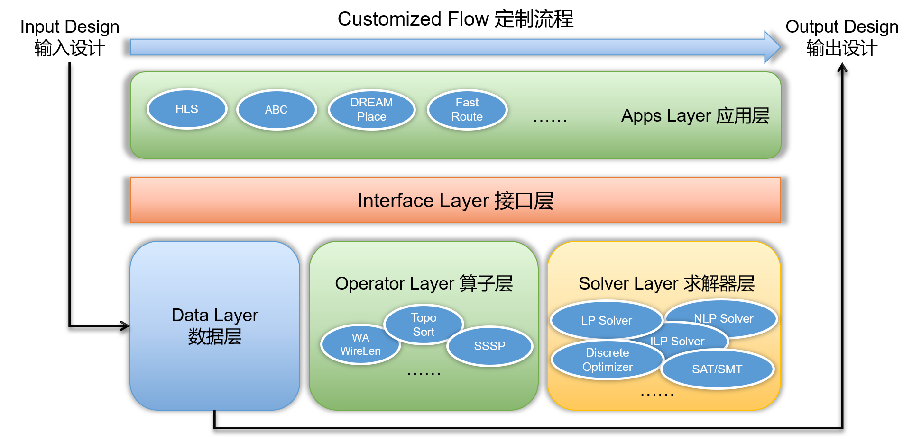

pagetime:
title: EDA Wiki

# 欢迎来到 **EDA Wiki** ！    

**EDA wiki** 是关于 EDA 算法和开源工具的协作文档；当前主要内容是开源 EDA 工具列表的整理。

OpenBELT 的愿景是令成熟的 EDA 技术保存在公共领域，使命是降低定制 EDA 工具和流程的开发代价，赋能芯片设计者和工艺研究者定制 EDA 流程，吸引各领域专家和爱好者涉足 EDA 问题，实现 EDA 领域的健康持续发展。目标的开源 EDA 软件架构 OpenBELT 如下图所示，包含：应用（具体 EDA 工具）、接口（编程接口）、数据（设计数据库/数据表示机制）、算子（EDA 算法部件/算法表示机制）、求解器（通用算法引擎）五部分。

接口层的初步尝试请见 [Cocoon](https://github.com/pku-dasys/cocoon) 项目，最终目的是以互通性和互动性解决 EDA 厂商锁定问题。支持同时集成商业工具和开源工具，令使用者拥有能获得与现有商业流程相同设计质量的保底方案。强调开放而非强求开源，避免开源全流程的设计质量受限于最弱点工具的问题，采取以全流程的商业工具为起点、逐步替换成高质量开源工具的路线。“Cocoon” 的名字可理解为 EDA 系统的 shell。敬请期待 Cocoon 的示例应用。

数据层是为解决当前极少 EDA 算法直接使用现有数据标准的API开发的问题，使开源 EDA 算法代码可重用。

算子层是为解决开源 EDA 代码难以定制的问题，设计算法表示机制，通过易懂的代码降低 EDA 算法阅读难度，分离算法表达和算法优化，使开发者专注于算法设计而不是性能优化，而通过现代编译技术来提升性能。

本项目文档内容托管于 [GitHub](https://github.com/pkuzjx/EDA-wiki) 和 阿里云[CODE](https://code.aliyun.com/openbelt/eda-wiki)，主要使用 [GitHub Issues](https://github.com/pkuzjx/EDA-wiki/issues) / [CODE Issues](https://code.aliyun.com/openbelt/eda-wiki/issues) 进行交流沟通，期待您的加入。
Email: zhangjiaxi@pku.edu.cn, daitoto@pku.edu.cn, gluo@pku.edu.cn。

## Material color palette 颜色主题

### Primary colors 主色

> 默认为 `white` 

点击色块可更换主题的主色

<button data-md-color-primary="red">Red</button>
<button data-md-color-primary="pink">Pink</button>
<button data-md-color-primary="purple">Purple</button>
<button data-md-color-primary="deep-purple">Deep Purple</button>
<button data-md-color-primary="indigo">Indigo</button>
<button data-md-color-primary="blue">Blue</button>
<button data-md-color-primary="light-blue">Light Blue</button>
<button data-md-color-primary="cyan">Cyan</button>
<button data-md-color-primary="teal">Teal</button>
<button data-md-color-primary="green">Green</button>
<button data-md-color-primary="light-green">Light Green</button>
<button data-md-color-primary="lime">Lime</button>
<button data-md-color-primary="yellow">Yellow</button>
<button data-md-color-primary="amber">Amber</button>
<button data-md-color-primary="orange">Orange</button>
<button data-md-color-primary="deep-orange">Deep Orange</button>
<button data-md-color-primary="brown">Brown</button>
<button data-md-color-primary="grey">Grey</button>
<button data-md-color-primary="blue-grey">Blue Grey</button>
<button data-md-color-primary="white">White</button>

### Accent colors 辅助色

> 默认为 `red` 

点击色块更换主题的辅助色

<button data-md-color-accent="red">Red</button>
<button data-md-color-accent="pink">Pink</button>
<button data-md-color-accent="purple">Purple</button>
<button data-md-color-accent="deep-purple">Deep Purple</button>
<button data-md-color-accent="indigo">Indigo</button>
<button data-md-color-accent="blue">Blue</button>
<button data-md-color-accent="light-blue">Light Blue</button>
<button data-md-color-accent="cyan">Cyan</button>
<button data-md-color-accent="teal">Teal</button>
<button data-md-color-accent="green">Green</button>
<button data-md-color-accent="light-green">Light Green</button>
<button data-md-color-accent="lime">Lime</button>
<button data-md-color-accent="yellow">Yellow</button>
<button data-md-color-accent="amber">Amber</button>
<button data-md-color-accent="orange">Orange</button>
<button data-md-color-accent="deep-orange">Deep Orange</button>

